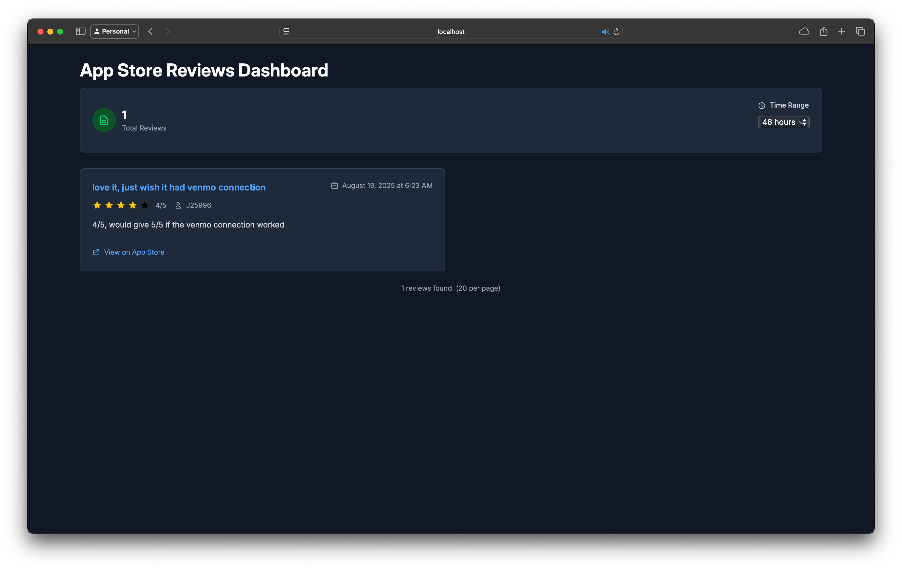

# App Store Reviews Dashboard

A full-stack application that retrieves and displays App Store reviews for iOS applications. 

## Demo

Here's the app in action:



https://github.com/0xTim/app-store-reviews/blob/main/demo.mov

## Architecture Overview

This application consists of two main components working together:

### 🖥️ Backend (Swift/Vapor)
- **Location**: `AppStoreDashboardBackend/`
- **Technology**: Swift with Vapor framework
- **Database**: SQLite for local data storage
- **Purpose**: 
  - Fetches app reviews from the App Store API
  - Stores review data persistently in SQLite database
  - Provides REST API endpoints for the frontend
  - Handles background jobs for periodic review updates

### 🌐 Frontend (React/TypeScript)
- **Location**: `AppStoreDashboard/`
- **Technology**: React with TypeScript, Vite build system
- **Purpose**:
  - Displays app reviews in an intuitive dashboard interface
  - Provides filtering and pagination capabilities
  - Shows review analytics and star ratings
  - Responsive design for various screen sizes

## Getting Started

Each project has its own README explaining how to run. However there's a Docker Compose file to demo to tie it all together. To run:

```bash
docker compose up --build
```

Then open your browser and navigate to `http://localhost:3000` to access the frontend dashboard.